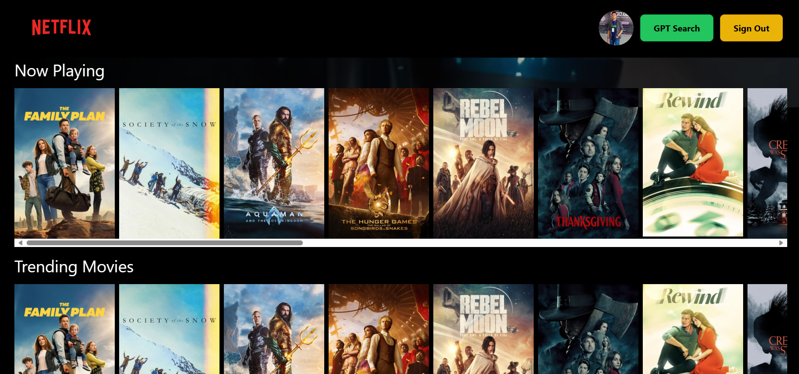

# Netflix GPT - Project Overview

## Tech Stack

The Netflix GPT project utilizes a robust tech stack to ensure a seamless user experience:

- **React JS**: A powerful JavaScript library for building user interfaces, providing a dynamic and efficient front-end.
- **Tailwind CSS**: A utility-first CSS framework that enables the creation of responsive and visually appealing user interfaces.
- **Vite Bundler**: A fast and efficient front-end build tool that enhances the development workflow.
- **React-Redux Toolkit**: The chosen state management tool for efficient state handling in complex applications.

## Features

The project incorporates a comprehensive authentication system with the following features:

- **Sign In/Sign Up Form**: Intuitive and user-friendly forms for a smooth authentication process.
- **Redirect to Browse Page**: Seamless redirection upon successful authentication, ensuring a cohesive user journey.
- **Error Page**: An error page to handle and communicate authentication issues effectively.
- **Multilanguage Support**: Enhancing accessibility with support for multiple languages.
- **Chat GPT Search**: Integration of Chat GPT for an intelligent search experience.
- **AI-Based Movie Search**: Utilization of AI for an advanced and personalized movie search feature.
- **Responsive Design**: Ensuring a consistent and visually appealing experience across both mobile and desktop devices.

_Note: React Router Dom v6.4 is employed for efficient routing._

## Development Progress

### Creating the Login Form

The project's development progress is detailed and structured, starting with the creation of the login form.

- **Converting Sign-In Form to Sign-Up Form**: An iterative approach to enhance form functionality.

### Creating the Sign-Up Form

A dedicated section for the creation of the Sign-Up form, ensuring a complete authentication solution.

### Utilizing useRef Hook

The project leverages the useRef hook for an enhanced form functionality, contributing to a more efficient user experience.

### Adding OpenAI API Key

To enrich the user experience, the project integrates OpenAI API for advanced functionalities.

- **Key Configuration**: Securely adding the OpenAI API key.
- **npm Install Command**: Clear instructions for installing the required dependencies.

## Output Snapshots

## Mobile - Responsive

, 
,

## Desktop - Responsive

,
,
,

## Learnings

This project has been a valuable learning experience, providing insights into several key aspects of software development:

- **Tech Stack Integration**: Successfully integrating technologies like React, Tailwind CSS, and Vite for a cohesive development environment.
- **Authentication System**: Building a robust authentication system with features such as sign-in/sign-up forms and error handling.
- **AI Integration**: Utilizing OpenAI for advanced features like Chat GPT and AI-based movie search.
- **Responsive Design**: Implementing a responsive design approach to ensure a consistent user experience across various devices.
- **State Management**: Implementing state management efficiently using React-Redux Toolkit to handle complex application states.
- **Development Workflow**: Utilizing the Vite Bundler for a fast and efficient development workflow.

## Project Aim

The primary aim of the Netflix GPT project is to provide users with a seamless and intelligent streaming experience. By integrating AI for movie recommendations and ensuring a user-friendly authentication system, the project aims to deliver a top-notch streaming platform.

## My Details

- **Name**: Sourabh Bhatt
- [ LinkedIn](https://linkedin.com/in/sourabh-bhatt)
- [ Twitter](https://twitter.com/sourabh__bhatt)
- [ GitHub](https://github.com/sourabh-bhatt)
- [ Hashnode](https://sourbhatt.hashnode.dev)

Feel free to explore the project and reach out for any further inquiries or collaborations.
